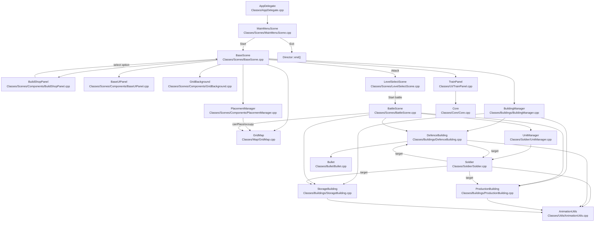

# VoidKings 项目理解与改造建议

> 生成日期: 2025-12-22
> 
> 说明: 该文档基于当前仓库源码与 docs 文档梳理，包含调用关系图、兵种训练数据流、建筑配置 JSON 驱动改造方案。

## 1. 模块调用关系图



说明:
- 入口场景由 `Classes/AppDelegate.cpp` 决定，当前启动 `MainMenuScene`
- `BaseScene` 是“基地经营主场景”，负责建造、训练、进攻入口
- `BattleScene` 通过 `Soldier::setEnemyBuildings` 与 `DefenceBuilding::setEnemySoldiers` 绑定战斗对象
- `AnimationUtils` 统一处理帧动画查找与缓存
- `IDCardPanel` 当前为静态文字显示，不与 `Core` 同步

## 2. 兵种训练 → 出战 数据流

### 关键数据通道
- 配置来源: `Resources/res/units_config.json` → `UnitManager::loadConfig`
- 资源来源: `Core` 维护金币/钻石，`TrainPanel` 消耗与显示
- 训练结果: `TrainPanel::_trainedUnits` 作为“可部署兵种”来源
- 战斗携带: `BaseScene::onAttackClicked` → `LevelSelectScene::setSelectedUnits`
- 部署消耗: `BattleScene::_remainingUnits` 随部署递减

### 流程步骤 (关键函数)
1. `BaseScene::init` 调用 `UnitManager::loadConfig("res/units_config.json")`
2. `TrainPanel::init` 读取 `UnitManager` 配置生成卡片，招募时调用 `Core::consumeResource`
3. `TrainPanel::recruitUnit` 更新 `_trainedUnits[unitId]++`
4. `BaseScene::onAttackClicked` 读取 `TrainPanel::getTrainedUnits`
5. `LevelSelectScene::setSelectedUnits` 更新预览并传给 `BattleScene::createScene`
6. `BattleScene::init` 将 `_deployableUnits` 拷贝到 `_remainingUnits`
7. 点击地图 `BattleScene::onTouchBegan` → `deploySoldier` → `UnitManager::spawnSoldier`
8. 单位生成后加入 `_soldierLayer`，`_remainingUnits[unitId]--`，UI 按钮刷新

备注:
- 训练后的兵种数量目前不会自动清空，若需要“出战即消耗”，可在战斗开始后调用 `TrainPanel::clearTrainedUnits`
- `TrainPanel` 会过滤不存在贴图的兵种，避免 UI 破图

## 3. 建筑配置 JSON 驱动改造方案

### 现状
- `Resources/res/buildings_config.json` 已存在，但 `BuildingManager::loadConfigs` 为空
- `BuildShopPanel` 与 `BaseScene::createBuildingFromOption` 使用硬编码配置
- 造成的结果是配置重复、难以调参、难以扩展

### 目标
- 建筑信息由 JSON 驱动，减少硬编码
- `BuildShopPanel` 与 `BaseScene` 仅依赖配置与 ID
- 建筑/子弹/尺寸/消耗保持单一来源

### 关键字段映射 (JSON → Config)
- `defenceBuildings[]` → `DefenceBuildingConfig`
  - `MAX_LEVEL` → `MAXLEVEL`
  - `AOE_RANGE` → `bulletAOERange`
  - `spritePath` 优先用于 `spriteFrameName` 资源加载
- `productionBuildings[]` → `ProductionBuildingConfig`
  - `PRODUCE_*` / `STORAGE_*` 数组映射到配置同名字段
- `bullets[]` → 子弹配置表 (速度、是否 AOE、范围)

### 分阶段实施

Phase 1: 加载器与数据表
- 在 `Classes/Buildings/BuildingManager.cpp` 实现 JSON 解析
- 增加 `_defenceConfigs/_productionConfigs/_storageConfigs` 填充逻辑
- 兼容 `MAX_LEVEL` 与 `MAXLEVEL` 命名差异

Phase 2: 建筑选择与创建
- 将 `BuildingOption` 改为 `buildingId + category`
- `BuildShopPanel` 通过 `BuildingManager` 获取可建建筑列表
- `BaseScene::createBuildingFromOption` 改为 `BuildingManager::create*Building(buildingId)`

Phase 3: 初始建筑与关卡
- 基地与兵营用 JSON 中 `isMainBase` / `isBarracks` 初始化
- `BattleScene` 可选引入 `levels_config.json` 描述敌方布局

Phase 4: 校验与容错
- 当等级数组长度不足时，取最后一项作为回退值
- 资源不存在则写日志并跳过，避免崩溃

### 接口草案 (示意)

```
struct BuildingCatalogItem {
  int id;
  int category;     // defence/production/storage
  std::string name;
  std::string spritePath;
  int gridWidth;
  int gridHeight;
  int costGold;
};

std::vector<BuildingCatalogItem> BuildingManager::getBuildCatalog() const;
cocos2d::Node* BuildingManager::createBuilding(int buildingId, int level);
```

### 验证建议
- 启动主菜单 → 进入基地 → 打开建造商店 → 放置建筑 → 退出重进
- 进入战斗场景 → 部署兵种 → 确认防御塔能索敌/发射
- 在 `Resources/res/buildings_config.json` 修改数值后，确认行为变更生效

### 相关文件清单
- `Classes/Buildings/BuildingManager.cpp`
- `Classes/Scenes/Components/BuildShopPanel.cpp`
- `Classes/Scenes/BaseScene.cpp`
- `Resources/res/buildings_config.json`
- `Classes/Bullet/Bullet.cpp`
- `Classes/Utils/AnimationUtils.cpp`
