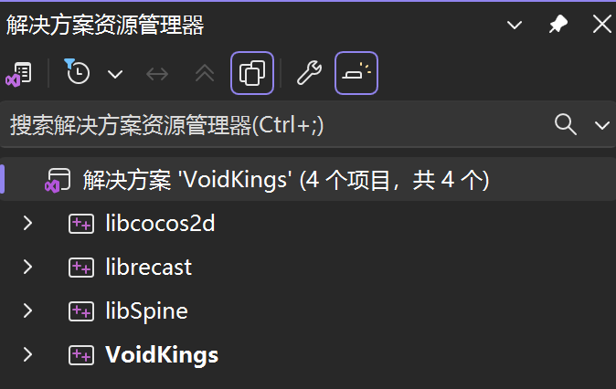
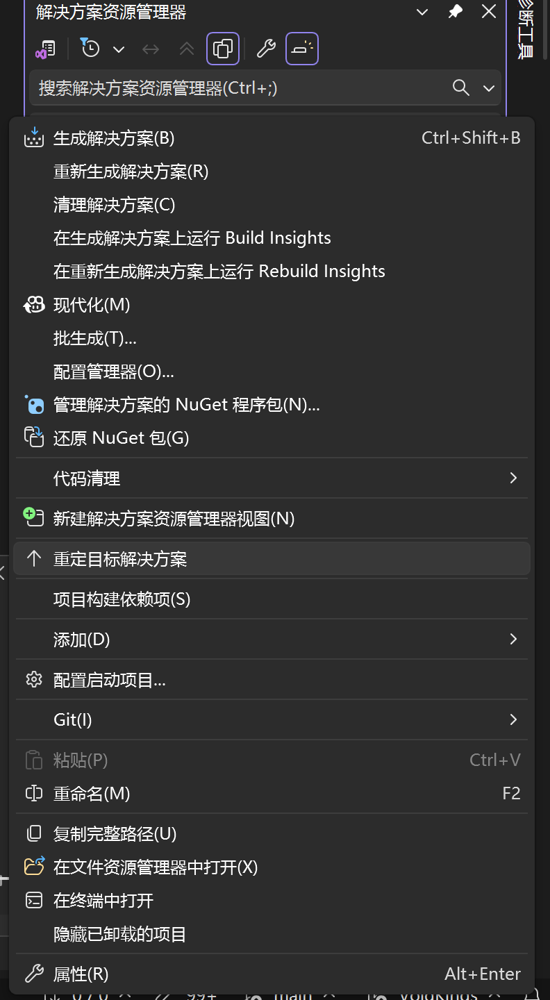

- 1.将该仓库clone到本地后，应该可以直接运行，如果不可以，立刻在群里说
- 2.我们的主要工作区为 `Classes`和 `proj.win32`，其余部分我会在之后加入 `.gitignore`
- 3.后续可能会做安卓开发，到时候我把它从ignore里头放出来就好
- 4.进行改动后，除了提交commit信息外，还请提交一份开发说明文档，说明改动内容和原因，放在docs目录下，命名格式为 `{日期}-{进行的改动（简写）}-{人名}.md`，后续方便进行考证，如果做得好的话可以整理成开发日志发布（这个可以要AI写，但是写完之后自己看一遍再交）
- 5.改动前一定要交流！！！
- 6.改动前一定要交流！！！！！！
- 7.改动前一定要交流！！！！！！！！！
- 8.以上为重要的事情说三遍
- 9.所有说明文档以及学习资料统一放在docs目录下，注意经常查阅
- 10.在成功clone该仓库后，请在visual studio中打开，随后打开名为VOIDKINGS的解决方案。如果编译失败，则右键该解决方案->重定解决方案（这个排版好丑啊不管了）
- 
- 11.⚠️ **重要：启动项目设置** - 运行项目时，请确保 `VoidKings` 项目（而不是 `libcocos2d`）被设置为启动项目。右键点击 `VoidKings` 项目 -> 选择"设为启动项目"。如遇到 "libcocos2d.dll 不是有效的 Win32 应用程序" 错误，请参考 `docs/故障排除指南.md`。
